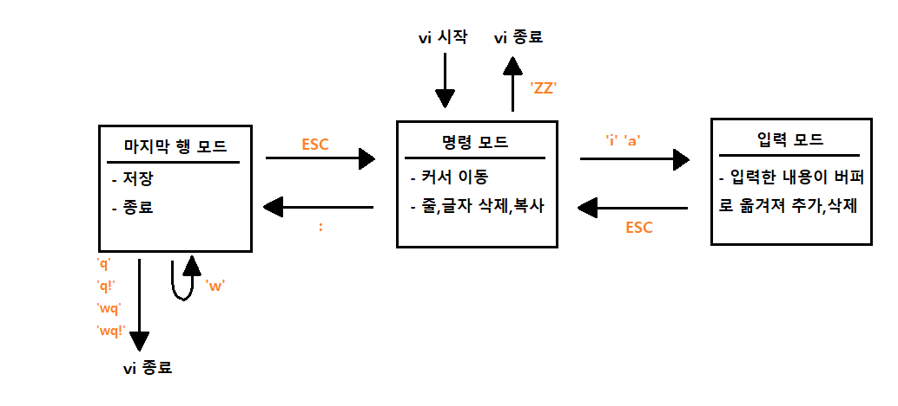

# [Linux] vi 편집기 명령어

> **vi 편집기는 명령모드, 입력모드, 마지막 행 모드로 총 3가지 모드**로 구성되어 있습니다.

### 명령 모드(command mode)

처음 vi 명령어로 vi를 시작하게 되면 들어가게 됩니다. 여기서는 **방향키를 이용하여 커서를 이동**할 수 있으며, **"dd" 나 "yy" 로 한 줄 삭제 및 한 줄 붙여넣기**, 또는 **"x" 명령어로 글자 하나를 삭제**할 수 있습니다.

 

### 입력 모드(insert mode)

**명령모드에서 "i" 나 "a" 명령**을 통해서 입력 모드로 넘어 갈 수있습니다. 입력모드로 가게되면, **자유롭게** 코드나 글을 **작성**을 하시면 됩니다. **명령 모드로 다시 돌아오려면 "ESC"**를 누르면 됩니다.

 

### 마지막 행 모드(last line mode)

마지막행 모드는 **명령모드에서 ":" (콜론) 을 입력**하면 화면 맨 밑단에 :______ 하며 입력을 할 수 있는 공간이 나옵니다. 여기서 현재까지 내가 작성한 이 내용을 저장하고 vi를 종료(wq)할지, 그냥 종료(q, q!)할지 등을 입력할 수 있습니다.

 

 

### 자주 사용하는 명령어

| 명령 모드               | 명령어 | 마지막 행 모드                  | 명령어   |
| ----------------------- | ------ | ------------------------------- | -------- |
| 파일의 끝으로 이동할 때 | G      | 저장만                          | :w       |
| 한 줄 잘라내기          | dd     | 종료만                          | :q       |
| 세 줄 잘라내기          | 3dd    | 저장 후 종료                    | :wq      |
| 붙여넣기                | p      | 라인 번호 좀 보자               | :set nu  |
| 한 글자 삭제            | x      | 커서 위치 뒤로 문자열 좀 찾자   | :?문자열 |
| 단어 삭제               | dw     | 커서 위치 앞으로 문자열 좀 찾자 | :/문자열 |
| 실행취소!               | u      | 강제할 때 명령어 뒤에           | !        |
| 줄의 맨 앞              | o      |                                 |          |
| 줄의 맨 뒤              | $      |                                 |          |

 

 

## 참고자료

[vi 명령어 정리](https://blockdmask.tistory.com/25)